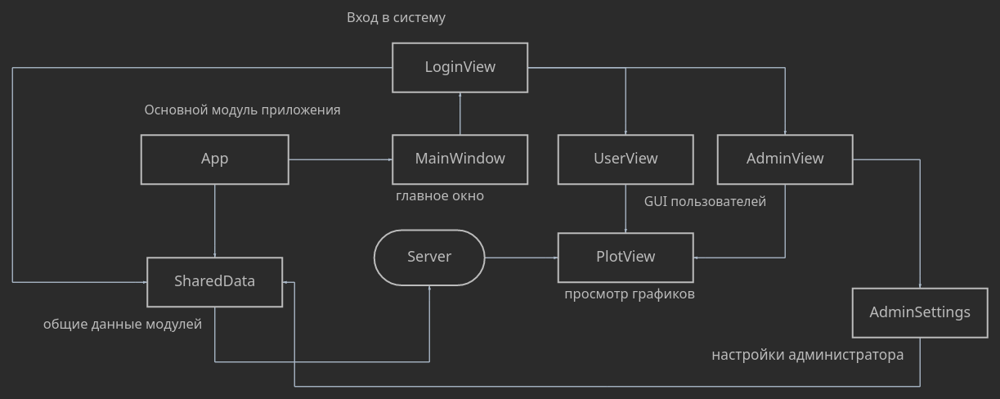
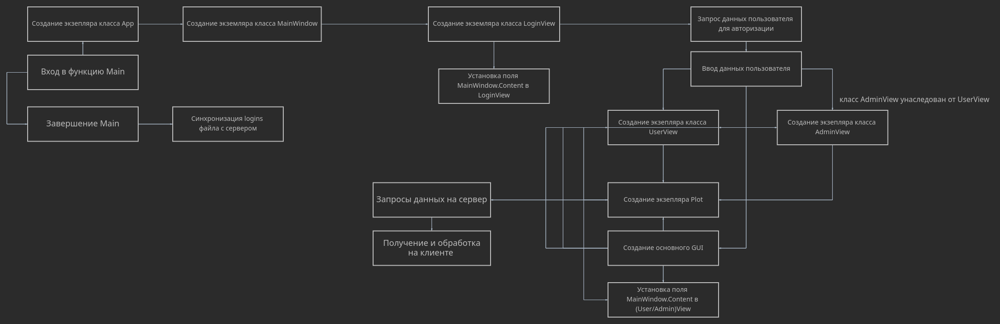
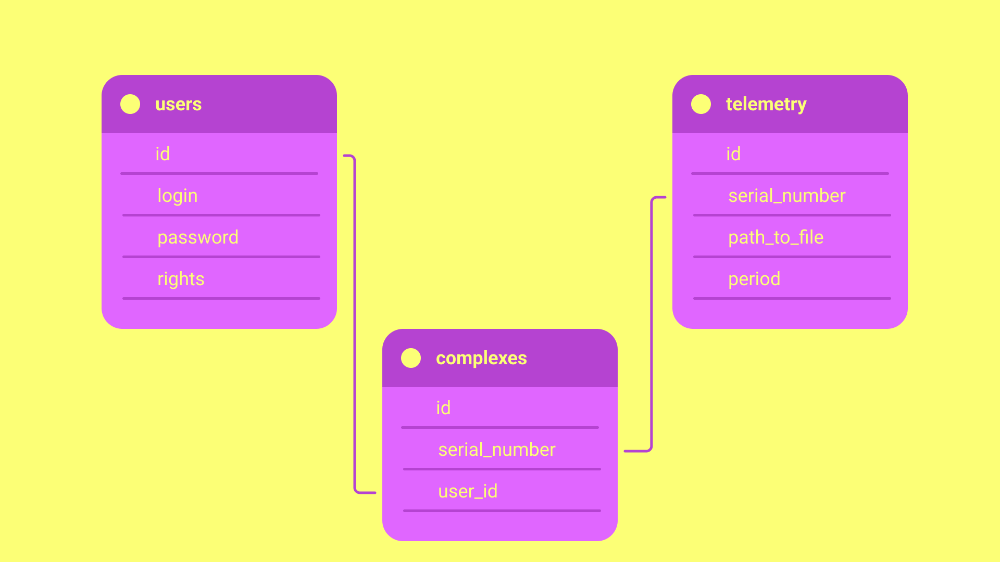
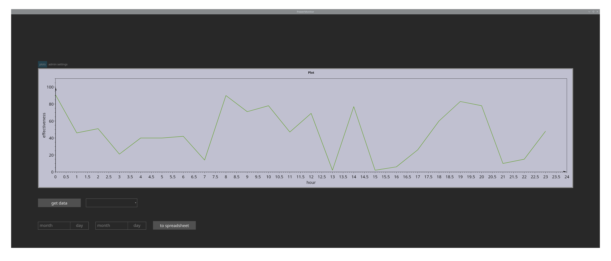
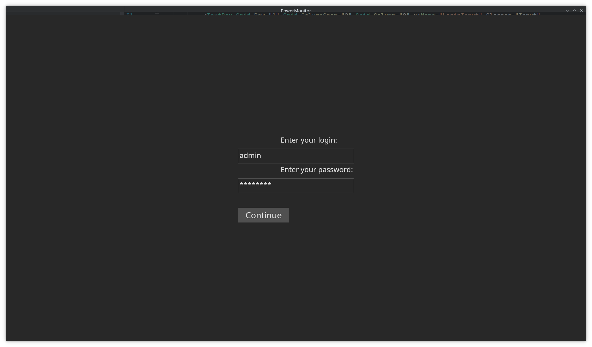

# Мониторинг комплекса энергоснабжения

## - Анализ технических требований -

В техническом задании указана модель клиент-серверного приложения. Клиент должен уметь соединятся с сервером, принимать
данные телеметрии и синхронизировать локальные настройки для поддержи единой базы пользователей среди клиентов сервера.
Клиент должен поддерживать построение графиков эффективности работы АКЭС, добавление/удаление/изменение учетных записей,
а также иметь GUI для взаимодействия с пользователем. Сервер должен уметь принимать различные запросы клиентов, работать
с серверной базой данных и выгружать из нее запрашиваемые клиентом данные по определенному критерию.
***

## - Обоснование выбора инструментария -

Для реализации клиента используется [AvaloniaUI](https://avaloniaui.net/) из-за широкой поддержки платформ, скорости
разработки и возможности использования широких возможностей [.NET 6](https://dotnet.microsoft.com/en-us/) и C#
> Avalonia is a cross-platform UI framework for dotnet, providing a flexible styling system and supporting a wide range of Operating Systems such as Windows, Linux, MacOs. Avalonia is mature and production ready. We also have in beta release support for iOS, Android and in early stages support for browser via WASM.

(цитата взята из официального репозитория AvaloniaUI)

Также были использованы пакеты [NuGet](https://www.nuget.org/) для реализации отдельных модулей клиента, их полный
список приведен ниже:

- [CsvHelper](https://www.nuget.org/packages/CsvHelper) (работа с *.csv файлами)
- [OxyPlot.Avalonia](https://www.nuget.org/packages/OxyPlot.Avalonia)
  и [OxyPlot.Core](https://www.nuget.org/packages/OxyPlot.Core) (работа с графиками)
- [ExtremelySimpleLogger](https://www.nuget.org/packages/ExtremelySimpleLogger) (логирование)
- [GemBox.Spreadsheet](https://www.nuget.org/packages/GemBox.Spreadsheet) (выгрузка данных в таблицу)

Выбор на эти пакеты пал в основном благодаря простоте работы с ними и их популярности.

Ассеты для GUI клиентской части были взяты из [Tela circle icon theme](https://github.com/vinceliuice/Tela-circle-icon-theme).

В основу серверной части лёг язык [Python](https://www.python.org) и
микрофреймворк [Flask](https://flask.palletsprojects.com/en/2.0.x/).

В качестве СУБД использовалась [SQLite](https://www.sqlite.org/index.html).

***

## - Структурная и функциональная схемы серверной и клиентской части -

### структурная схема клиента:

### функциональная схема клиента:

> функциональная схема описывает только основные и
> в большинстве заметные пользователю действия, вследствие этого
> большая часть функциональности контроллеров не представлена

_(commented by Ash_Fungor)_
***

## - Схема базы данных -

***

## - Скриншоты -

> скриншоты ранней версии, основной клиент еще в разработке

_(commented by Ash_Fungor)_
***

[Ссылка на репозиторий](https://github.com/AshFungor/PowerMonitor)
