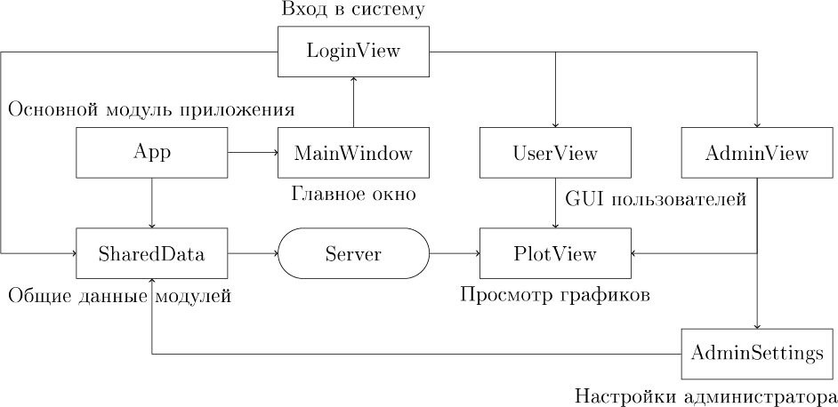
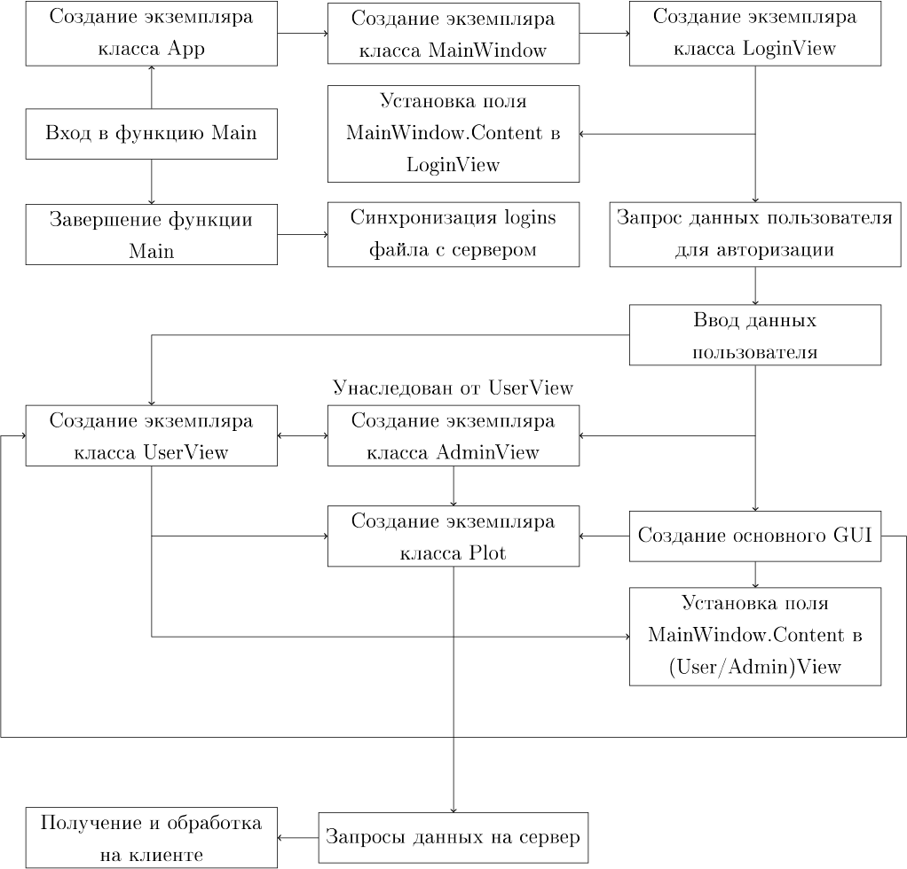
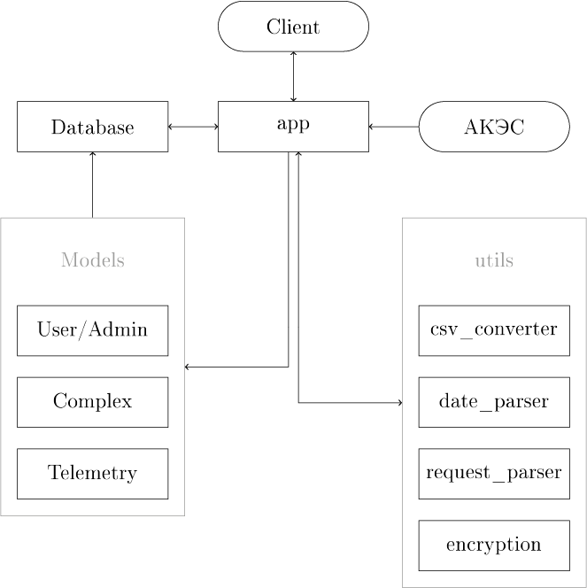
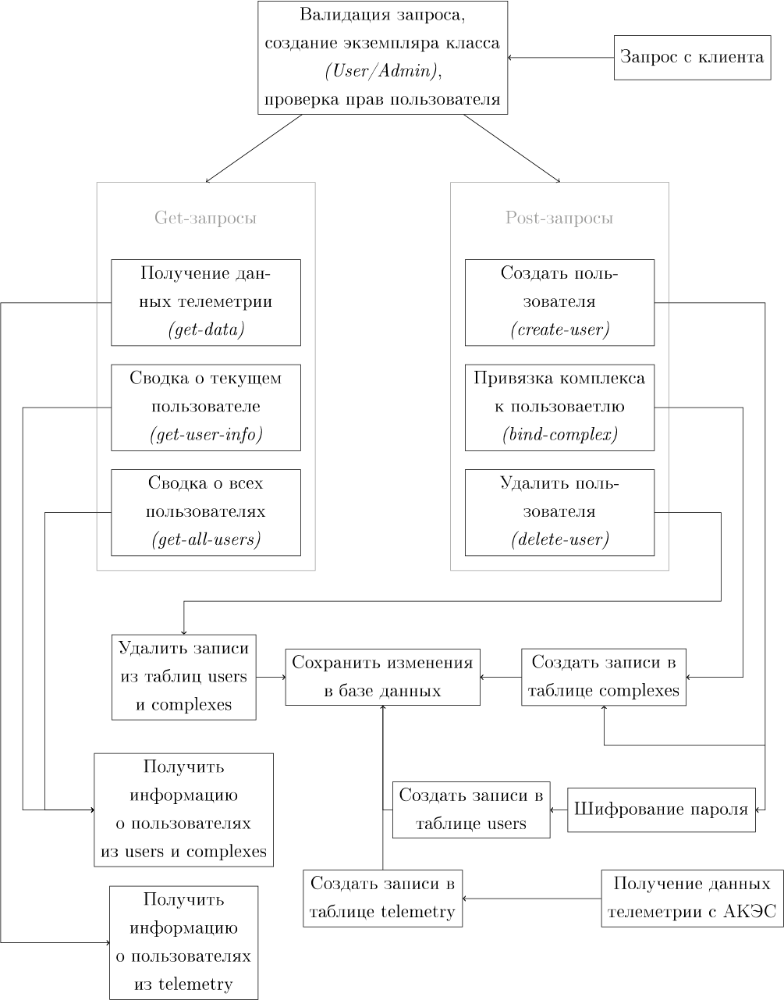
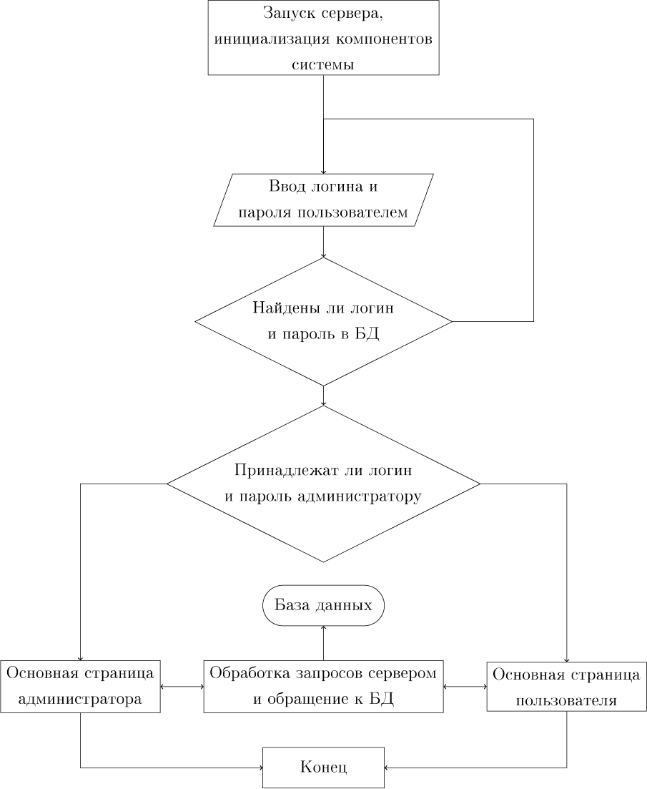
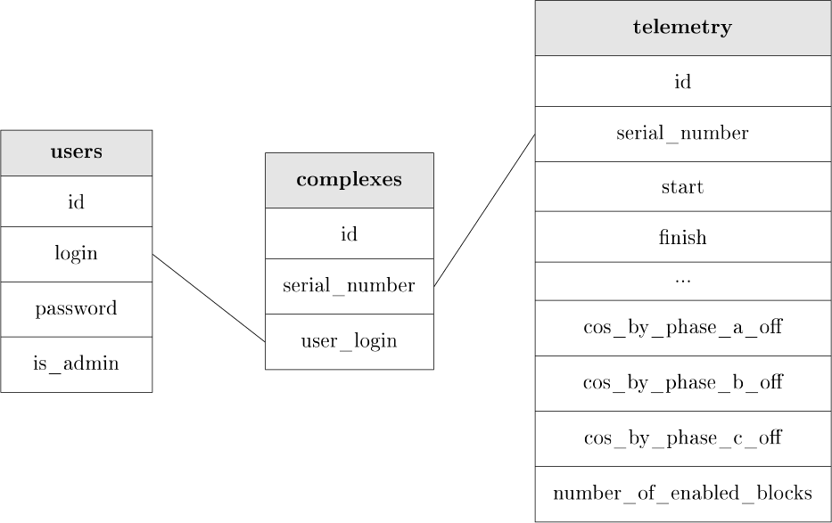
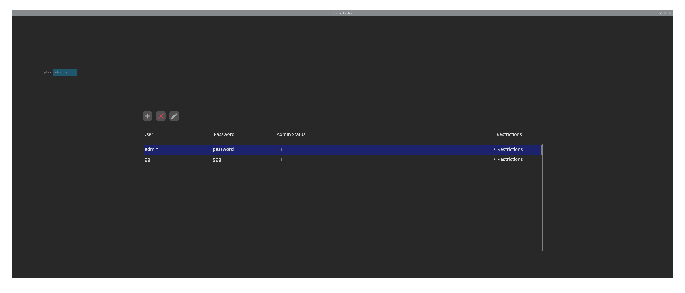

# Мониторинг комплекса энергоснабжения

## - Анализ технических требований -

В техническом задании указана модель клиент-серверного приложения. Клиент должен уметь соединятся с сервером, принимать
данные телеметрии и синхронизировать локальные настройки для поддержи единой базы пользователей среди клиентов сервера.
Клиент должен поддерживать построение графиков эффективности работы АКЭС, добавление/удаление/изменение учетных записей,
а также иметь GUI для взаимодействия с пользователем. Сервер должен уметь принимать различные запросы клиентов, работать
с серверной базой данных и выгружать из нее запрашиваемые клиентом данные по определенному критерию.
***

## - Обоснование выбора инструментария -

Для реализации клиента используется [AvaloniaUI](https://avaloniaui.net/) из-за широкой поддержки платформ, скорости
разработки и возможности использования широких возможностей [.NET 6](https://dotnet.microsoft.com/en-us/) и C#
> Avalonia is a cross-platform UI framework for dotnet, providing a flexible styling system and supporting a wide range
> of Operating Systems such as Windows, Linux, MacOs. Avalonia is mature and production ready. We also have in beta
> release support for iOS, Android and in early stages support for browser via WASM.

_(цитата взята из официального репозитория AvaloniaUI)_

Также были использованы пакеты [NuGet](https://www.nuget.org/) для реализации отдельных модулей клиента, их полный
список приведен ниже:

- [CsvHelper](https://www.nuget.org/packages/CsvHelper) (работа с *.csv файлами)
- [OxyPlot.Avalonia](https://www.nuget.org/packages/OxyPlot.Avalonia)
  и [OxyPlot.Core](https://www.nuget.org/packages/OxyPlot.Core) (работа с графиками)
- [ExtremelySimpleLogger](https://www.nuget.org/packages/ExtremelySimpleLogger) (логирование)
- [GemBox.Spreadsheet](https://www.nuget.org/packages/GemBox.Spreadsheet) (выгрузка данных в таблицу)
- [Avalonia.Svg.Skia](https://www.nuget.org/packages/Avalonia.Svg) (отображение .svg изображений)
- [Newtonsoft.Json](https://www.nuget.org/packages/Newtonsoft.Json/) (обработка JSON)

Выбор на эти пакеты пал в основном благодаря простоте работы с ними и их популярности.

Ассеты для GUI клиентской части были взяты
из [Tela circle icon theme](https://github.com/vinceliuice/Tela-circle-icon-theme).

Сервер был реализован на языке [Python](https://www.python.org) с использованием микрофреймворка
[Flask](https://flask.palletsprojects.com/en/2.1.x/), предоставляющего широкий набор инструментов для обработки
запросов, тестирования и реализации интерфейса взаимодействия, а также обеспечивающего высокую скорость разработки.
> Flask is a lightweight WSGI web application framework. It is designed to make getting started quick and easy, with the
> ability to scale up to complex applications. It began as a simple wrapper around Werkzeug and Jinja and has become
> one of the most popular Python web application frameworks.

_(цитата взята из официального репозитория Flask)_

Помимо основного фреймворка в реализации серверной части были использованы такие модули, как:

- [psycopg2](https://www.psycopg.org/docs/) (работа с СУБД)
- [pydantic](https://pydantic-docs.helpmanual.io) (валидация данных и работа с json)
- [python-dotenv](https://pypi.org/project/python-dotenv/) (работа с переменными окружения)
- [cryptography](https://pypi.org/project/cryptography/) (шифрование паролей)

В качестве системы управления базами данных была выбрана [PostgreSQL](https://www.postgresql.org), как одна из наиболее
мощных и широко используемых реляционных СУБД.

> PostgreSQL is a powerful, open source object-relational database system with over 30 years of active development that
> has earned it a strong reputation for reliability, feature robustness, and performance.

_(цитата взята из официального сайта PostgreSQL)_

***

## - Структурная и функциональная схемы серверной и клиентской части -

### структурная схема клиента:

### функциональная схема клиента:

> функциональная схема описывает только основные и
> в большинстве заметные пользователю действия, вследствие этого
> большая часть функциональности контроллеров не представлена

### структурная схема сервера:

### функциональная схема сервера:

_(commented by Ash_Fungor)_
***

## - Блок-схема работы основного алгоритма -

***

## - Схема базы данных -

***

## - Скриншоты -

> возможны небольшие изменения в GUI клиента

_(commented by Ash_Fungor)_
***

## - Описание проведенных испытаний -

https://user-images.githubusercontent.com/77846294/163652996-c67a0fc7-3989-4ccd-bf26-cc5a5886a121.mp4

***

[Ссылка на репозиторий](https://github.com/AshFungor/PowerMonitor)
